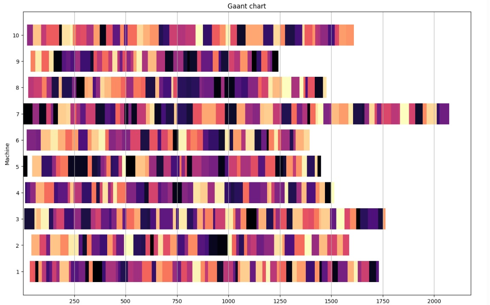
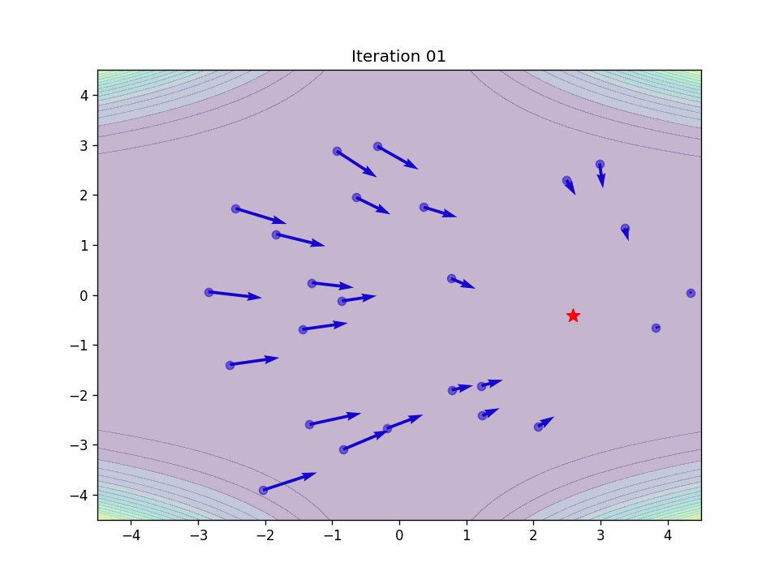

# 🤖 AI Core Algorithms

This repository is dedicated to implementing core Artificial Intelligence algorithms from scratch. It is designed for educational purposes and experimentation with various AI-based approaches to optimization and search problems.

---

## 🧠 Algorithm Overview

### 1. **TSP – Traveling Salesman Problem**

A collection of different AI approaches to solving the classic TSP:

- 🔍 **DFS / BFS**: Brute-force traversal of the graph to find valid paths.
- 📊 **NN / KNN**: Nearest Neighbor and K-Nearest Neighbor heuristics.
- 🌟 **A\***: Pathfinding with both admissible and non-admissible heuristics.
- 🐜 **Ant Colony Optimization**: A bio-inspired algorithm modeling the behavior of ants to find optimal paths.

All methods are implemented manually for a better understanding of each approach, with performance comparisons.

---

### 2. **Genetic Algorithm – Work Scheduling**

A Genetic Algorithm (GA) is used to generate optimal or near-optimal work schedules.

- Each individual encodes a possible schedule.
- Operators: Selection, Crossover, and Mutation.
- Fitness is based on meeting constraints and minimizing schedule conflicts.
- 🟩 Final output includes **Gantt chart visualizations** (screenshots provided).
- 
  
---

### 3. **Particle Swarm Optimization – Function Minimization**

Particle Swarm Optimization (PSO) is applied to find the minimum of a mathematical function `f(x, y)`.

- Particles move through the search space influenced by:
  - Their own best known position
  - The global best known position
- ✨ The optimization process is visualized using an animated **GIF** showing particle movement over iterations.

- 
  
---

## 👨‍💻 Author

**Paweł Marchel**  
If you find this project helpful, feel free to star ⭐ the repo or get in touch for collaboration.
